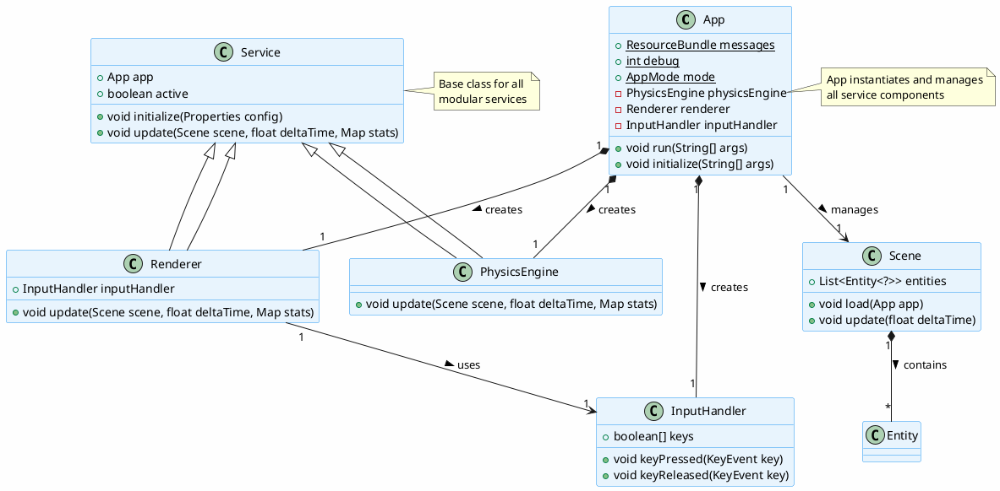
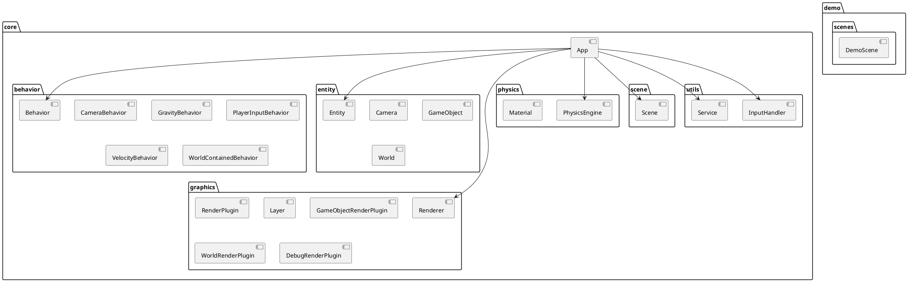
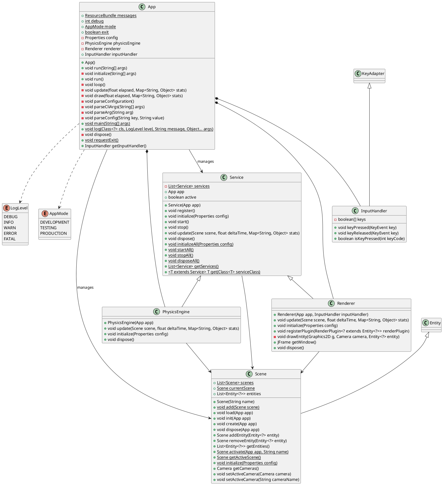
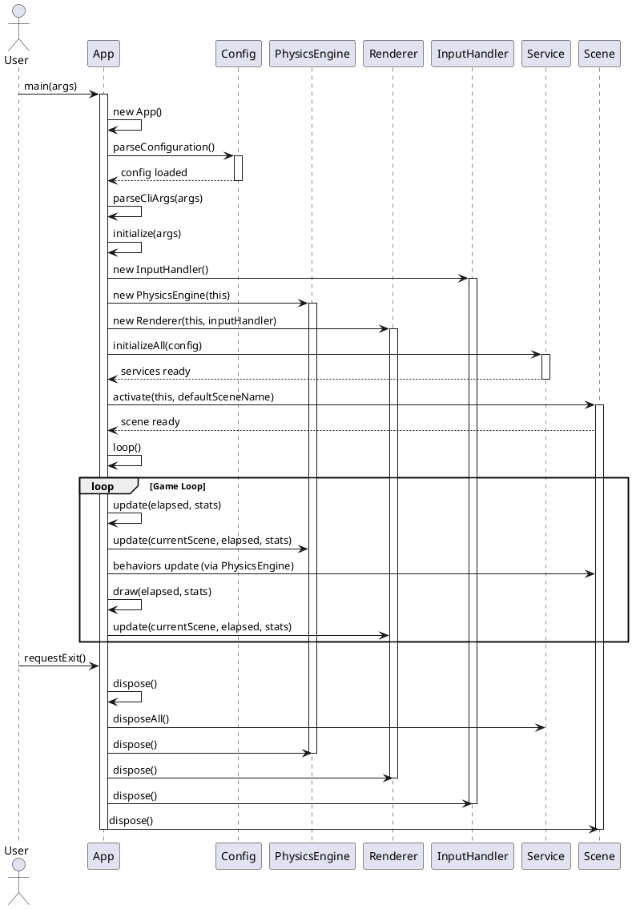
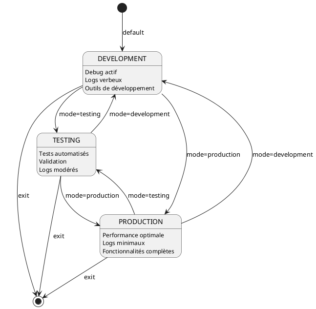

# Architecture globale de l'application

## Vue d'ensemble

La classe `App` constitue le point d'entrée et le coordinateur central de l'application. Elle orchestre l'ensemble des composants principaux et gère le cycle de vie complet de l'application, depuis l'initialisation jusqu'à la libération des ressources.

## Architecture générale

L'application suit une architecture modulaire organisée autour d'un moteur de jeu classique avec une boucle principale (game loop). Les composants clés sont gérés par la classe `App` qui assure leur coordination.

### Diagramme d'architecture

### Diagramme de packages

### Diagramme de classes principal

## Composants principaux

### 1. La classe App

La classe `App` est le cœur de l'application. Elle assume plusieurs responsabilités :

- **Initialisation** : Charge la configuration, analyse les arguments de ligne de commande et initialise tous les sous-systèmes
- **Orchestration** : Coordonne les services, les scènes et les composants moteur
- **Boucle principale** : Exécute la game loop qui gère les phases de mise à jour et de rendu
- **Configuration** : Gère les propriétés de configuration et l'internationalisation (i18n)
- **Logging** : Fournit un système de journalisation centralisé avec différents niveaux

### 2. Moteur physique (PhysicsEngine)

Le `PhysicsEngine` est responsable de la simulation physique de l'application. Il met à jour les états physiques des entités dans une scène, appliquant les comportements aux scènes et aux entités.

**Méthodes principales :**

- `update(Scene scene, float deltaTime, Map<String, Object> stats)` : Met à jour la physique de la scène et de ses entités.
- `initialize(Properties config)` : Initialise le moteur physique avec la configuration.
- `dispose()` : Libère les ressources du moteur physique.

### 3. Moteur de rendu (Renderer)

Le `Renderer` gère l'affichage graphique de l'application. Il rend les scènes en utilisant des plugins de rendu et gère une fenêtre d'affichage.

**Méthodes principales :**

- `update(Scene scene, float deltaTime, Map<String, Object> stats)` : Rend la scène sur l'écran.
- `initialize(Properties config)` : Initialise le renderer, crée la fenêtre et enregistre les plugins.
- `registerPlugin(RenderPlugin<? extends Entity<?>> renderPlugin)` : Enregistre un plugin de rendu.
- `dispose()` : Libère les ressources du renderer et ferme la fenêtre.

### 4. Gestionnaire d'entrées (InputHandler)

L'`InputHandler` capture et traite les entrées utilisateur (clavier). Il maintient l'état des touches et gère les événements spéciaux.

**Méthodes principales :**

- `keyPressed(KeyEvent key)` : Gère l'appui sur une touche.
- `keyReleased(KeyEvent key)` : Gère le relâchement d'une touche et traite les clés spéciales.
- `isKeyPressed(int keyCode)` : Vérifie si une touche est actuellement pressée.

### 5. Services et Scènes

- **Service** : Classe de base pour les composants modulaires avec cycle de vie (initialize, start, stop, update, dispose). Gère une liste statique de services.
- **Scene** : Représente un état de l'application, gère une liste d'entités. Étend Entity<Scene>.

**Méthodes principales de Scene :**

- `load(App app)`, `init(App app)`, `create(App app)`, `dispose(App app)` : Cycle de vie de la scène.
- `addEntity(Entity<?> entity)`, `removeEntity(Entity<?> entity)`, `getEntities()` : Gestion des entités.
- `activate(App app, String name)` : Active une scène par nom.
- `getActiveScene()` : Retourne la scène active.
- `initialize(Properties config)` : Initialise les scènes depuis la configuration.

## Diagramme de séquence : Démarrage de l'application

## Cycle de vie de l'application

### Phase 1 : Initialisation

1. Chargement du fichier de configuration (`parseConfiguration()`)
2. Analyse des arguments de ligne de commande (`parseCliArgs()`)
3. Création des composants principaux (InputHandler, PhysicsEngine, Renderer)
4. Initialisation des services (`Service.initializeAll()`)
5. Activation de la scène initiale (`Scene.activate()`)

### Phase 2 : Boucle principale

La méthode `loop()` exécute continuellement :

1. **Update** (`update()`):
   - Mise à jour du moteur physique (`physicsEngine.update()`)
   - Application des comportements aux entités via le PhysicsEngine

2. **Draw** (`draw()`):
   - Rendu de la scène via le Renderer (`renderer.update()`)

### Phase 3 : Terminaison

La méthode `dispose()` libère les ressources dans l'ordre inverse de création :

- Libération des services (`Service.disposeAll()`)
- Libération du moteur physique
- Libération du renderer
- Libération de l'input handler

## Diagramme d'états : Modes de l'application

## Configuration et internationalisation

L'application utilise deux mécanismes de configuration :

1. **Fichier de propriétés** : Configuration technique (résolution, FPS, etc.)
2. **ResourceBundle** : Messages internationalisés (i18n) via `ResourceBundle.getBundle("i18n/messages")`

## Système de logging

Le système de logging (`log()`) offre 5 niveaux de verbosité :

- **DEBUG** : Informations détaillées pour le débogage
- **INFO** : Informations générales sur l'exécution
- **WARN** : Avertissements sur des situations potentiellement problématiques
- **ERROR** : Erreurs nécessitant attention
- **FATAL** : Erreurs critiques entraînant l'arrêt

## Points d'extension

L'architecture permet l'extension via :

1. **Services personnalisés** : Implémentation de l'interface `Service`
2. **Scènes personnalisées** : Implémentation de l'interface `Scene`
3. **Configuration** : Ajout de nouvelles propriétés dans le fichier de configuration
4. **Mode de fonctionnement** : Adaptation du comportement selon `AppMode`
