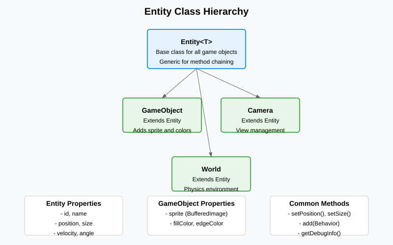
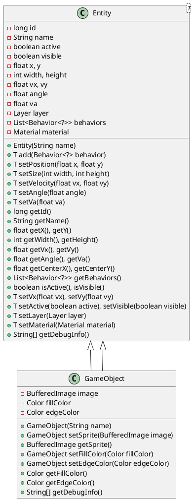

# Entity Class

## Vue d'ensemble

La classe `Entity` constitue la base de tous les objets du jeu dans l'application. Elle fournit une structure commune pour représenter des entités avec des propriétés physiques, des comportements et des informations de rendu. La classe est générique (`Entity<T>`) pour permettre un chaînage fluide des méthodes (fluent interface).

## Architecture

### Classe Entity<T>

La classe `Entity` est définie dans le package `core.entity` et sert de classe de base pour toutes les entités du jeu.

#### Attributs principaux

- **id** (long) : Identifiant unique auto-incrémenté pour chaque entité
- **name** (String) : Nom de l'entité (par défaut "entity_" + id)
- **active** (boolean) : Indique si l'entité est active et doit être mise à jour
- **visible** (boolean) : Indique si l'entité doit être rendue
- **x, y** (float) : Position de l'entité dans l'espace 2D
- **width, height** (int) : Dimensions de l'entité
- **vx, vy** (float) : Vitesse linéaire sur les axes x et y
- **angle** (float) : Angle de rotation en degrés
- **va** (float) : Vitesse angulaire en degrés/seconde
- **layer** (Layer) : Couche de rendu de l'entité
- **behaviors** (List<Behavior<?>>) : Liste des comportements attachés
- **material** (Material) : Matériau physique de l'entité

#### Constructeur

```java
public Entity(String name)
```

Crée une nouvelle entité avec le nom spécifié.

#### Méthodes principales

##### Gestion de la position et des dimensions

```java
public T setPosition(float x, float y)
public T setSize(int width, int height)
public T setVelocity(float vx, float vy)
public T setAngle(float angle)
public T setVa(float va)
```

##### Gestion des comportements

```java
public T add(Behavior<?> behavior)
public List<Behavior<?>> getBehaviors()
```

##### Getters

```java
public long getId()
public String getName()
public float getX(), getY()
public int getWidth(), getHeight()
public float getVx(), getVy()
public float getAngle(), getVa()
public float getCenterX(), getCenterY()
public boolean isActive(), isVisible()
public Layer getLayer()
public Material getMaterial()
```

##### Setters avec chaînage

```java
public T setVx(float vx), setVy(float vy)
public T setActive(boolean active), setVisible(boolean visible)
public T setLayer(Layer layer)
public T setMaterial(Material material)
```

##### Informations de débogage

```java
public String[] getDebugInfo()
```

Retourne un tableau de chaînes contenant les informations de débogage de l'entité.

## Classe héritière : GameObject

La classe `GameObject` hérite de `Entity<GameObject>` et représente un objet de jeu avec des capacités de rendu graphique spécifiques.

### Attributs supplémentaires

- **image** (BufferedImage) : Sprite ou image associée à l'objet
- **fillColor** (Color) : Couleur de remplissage (par défaut BLUE)
- **edgeColor** (Color) : Couleur des contours (par défaut WHITE)

### Constructeur

```java
public GameObject(String name)
```

### Méthodes spécifiques

##### Gestion du sprite

```java
public GameObject setSprite(BufferedImage image)
public BufferedImage getSprite()
```

##### Gestion des couleurs

```java
public GameObject setFillColor(Color fillColor)
public GameObject setEdgeColor(Color edgeColor)
public Color getFillColor()
public Color getEdgeColor()
```

##### Informations de débogage (override)

```java
@Override
public String[] getDebugInfo()
```

Retourne des informations de débogage spécifiques à GameObject, incluant l'ID, le nom, la position et la taille.

## Diagramme de classes





## Utilisation

### Création d'une entité de base

```java
Entity<?> entity = new Entity<>("myEntity")
    .setPosition(100, 200)
    .setSize(50, 50)
    .setVelocity(10, 0);
```

### Création d'un GameObject

```java
GameObject player = new GameObject("player")
    .setPosition(0, 0)
    .setSize(32, 32)
    .setFillColor(Color.RED)
    .setEdgeColor(Color.BLACK);
```

## Points d'extension

La conception générique de `Entity<T>` permet de créer facilement de nouvelles classes d'entités spécialisées en héritant et en spécifiant le type de retour pour le chaînage. Par exemple :

- `Camera` pour les caméras de vue
- `World` pour les mondes/conteneurs
- Autres entités spécifiques au jeu

Chaque entité peut avoir des comportements attachés via la liste `behaviors`, permettant une logique modulaire et réutilisable.
