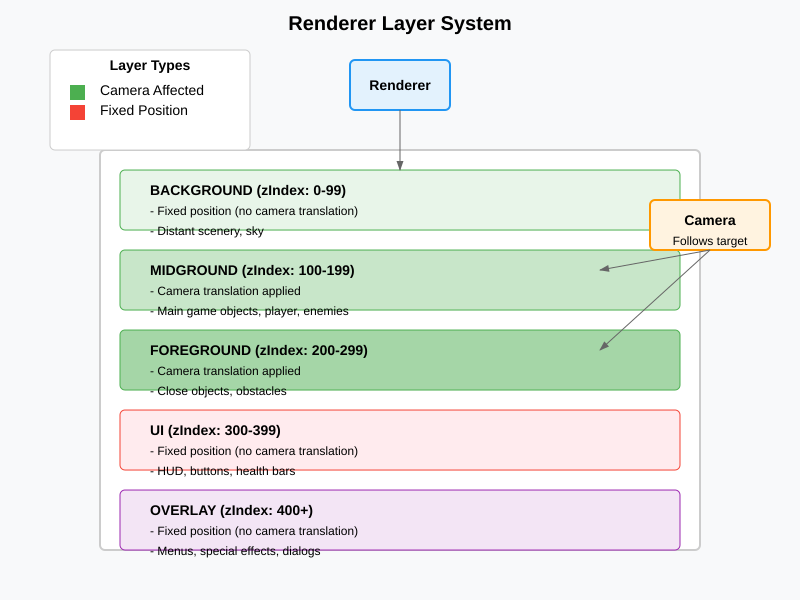
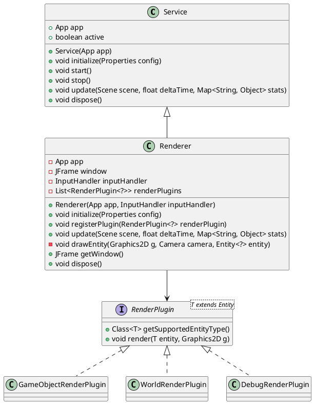

# Renderer Service

## Vue d'ensemble

Le `Renderer` est un service spécialisé dans le rendu graphique des entités du jeu. Il hérite de la classe `Service` et gère l'affichage en utilisant une fenêtre Swing avec une stratégie de buffer double pour des performances optimales. Le renderer utilise un système de plugins pour rendre différents types d'entités de manière modulaire.

## Architecture

### Héritage et dépendances

La classe `Renderer` hérite de `Service` et dépend des composants suivants :
- `App` : Instance principale de l'application
- `InputHandler` : Pour la gestion des entrées clavier
- `Scene` : Scène contenant les entités à rendre
- `Entity` : Entités à afficher
- `Camera` : Caméra pour la translation des vues
- `Layer` : Gestion des couches de rendu
- `RenderPlugin` : Plugins de rendu spécialisés

### Attributs principaux

- **app** (App) : Référence à l'application principale
- **window** (JFrame) : Fenêtre d'affichage Swing
- **inputHandler** (InputHandler) : Gestionnaire d'entrées
- **renderPlugins** (List<RenderPlugin<?>>) : Liste des plugins de rendu enregistrés

### Constructeur

```java
public Renderer(App app, InputHandler inputHandler)
```

Crée un nouveau renderer avec les dépendances nécessaires et s'enregistre automatiquement comme service.

## Fonctionnalités

### 1. Initialisation (`initialize`)

La méthode `initialize` configure la fenêtre d'affichage :
- Définit les dimensions par défaut (800x600) ou utilise la configuration
- Crée une JFrame avec titre internationalisé
- Configure les listeners pour la fermeture et les entrées clavier
- Initialise la stratégie de buffer (triple buffering)
- Enregistre les plugins de rendu par défaut :
  - `GameObjectRenderPlugin`
  - `WorldRenderPlugin`
  - `DebugRenderPlugin`

### 2. Gestion des plugins (`registerPlugin`)

```java
public void registerPlugin(RenderPlugin<? extends Entity<?>> renderPlugin)
```

Permet d'ajouter dynamiquement des plugins de rendu pour supporter de nouveaux types d'entités.

### 3. Rendu principal (`update`)

La méthode `update` effectue le rendu complet d'une scène :
- Vérifie l'état de la fenêtre
- Obtient le contexte graphique via BufferStrategy
- Configure les hints de rendu (antialiasing)
- Efface l'écran
- Récupère la caméra active de la scène
- Rend toutes les entités actives et visibles, triées par couche
- Applique la translation caméra pour les couches midground/foreground
- Affiche les statistiques de débogage en mode développement
- Finalise le rendu et affiche le buffer

### 4. Rendu d'entité individuelle (`drawEntity`)

Méthode privée qui :
- Applique la translation caméra si nécessaire
- Sélectionne le plugin approprié selon le type d'entité
- Délègue le rendu au plugin
- Annule la translation caméra

### 5. Libération des ressources (`dispose`)

Ferme la fenêtre et libère les ressources graphiques.

## Système de plugins

Le renderer utilise une architecture modulaire avec des plugins :
- Chaque plugin hérite de `RenderPlugin<T>`
- Implémente `render(Entity entity, Graphics2D g)`
- Spécifie le type d'entité supporté via `getSupportedEntityType()`
- Permet l'extension facile pour de nouveaux types d'entités

## Gestion des couches et caméra

- **Couches** : BACKGROUND, MIDGROUND, FOREGROUND
- **Translation caméra** : Appliquée seulement aux couches MIDGROUND et FOREGROUND
- **Tri des entités** : Par z-index de couche pour l'ordre de rendu

### Système de couches



## Mode débogage

En mode DEVELOPMENT avec debug > 0 :
- Affiche un overlay avec statistiques (FPS, temps, nombre d'entités)
- Met à jour les stats de rendu

## Diagramme de classes



## Intérêt de la classe Service

La classe `Service` constitue la base pour tous les composants modulaires de l'application qui nécessitent un cycle de vie géré. Elle apporte plusieurs avantages architecturaux :

### 1. Gestion centralisée du cycle de vie

- **Initialisation** : Méthode `initialize()` appelée une fois au démarrage
- **Démarrage/Arrêt** : Méthodes `start()`/`stop()` pour contrôler l'activité
- **Mise à jour** : Méthode `update()` appelée à chaque frame
- **Libération** : Méthode `dispose()` pour nettoyer les ressources

### 2. Gestion statique des services

- Liste globale de tous les services enregistrés
- Méthodes statiques pour contrôler tous les services :
  - `initializeAll()`, `startAll()`, `stopAll()`, `disposeAll()`
- Récupération de services par type : `get(Class<T> serviceClass)`

### 3. Auto-enregistrement

Chaque service s'enregistre automatiquement dans la liste statique lors de la construction, simplifiant la gestion.

### 4. Interface commune

Tous les services implémentent la même interface, permettant :
- Un traitement uniforme par l'application
- L'extensibilité facile (nouveaux services)
- La modularité (services indépendants)

### 5. Logging intégré

Chaque action importante (start, stop) est loggée automatiquement.

Cette architecture permet à l'application de gérer facilement des composants complexes comme le Renderer, le PhysicsEngine, etc., tout en maintenant une séparation claire des responsabilités et un cycle de vie cohérent.