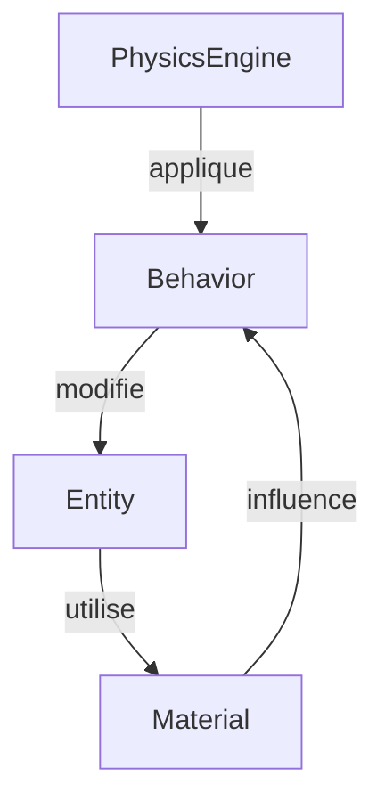
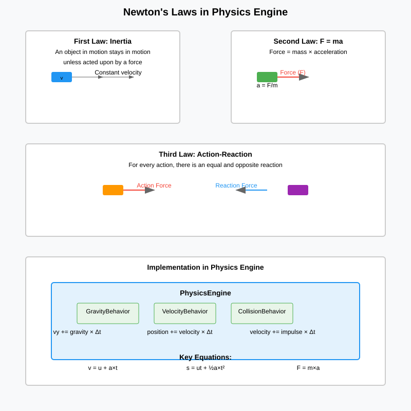
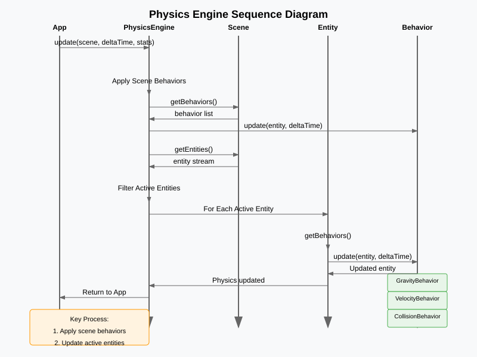

# The Physics Engine

## Vue d'ensemble

Le `PhysicsEngine` est un service responsable de la simulation physique des entités dans une scène. Il hérite de `Service` et applique les comportements physiques aux entités actives, gérant ainsi le mouvement, les collisions et les interactions basées sur les lois physiques simplifiées.

### Interactions entre les composants physiques

Le moteur physique repose sur trois composants principaux qui interagissent pour simuler le comportement des objets :



**Flux d'interaction :**
1. **PhysicsEngine** : Orchestre la simulation en appliquant les comportements
2. **Behavior** : Contient la logique physique (gravité, vitesse, collisions)
3. **Entity** : Représente les objets physiques avec position, vitesse et propriétés
4. **Material** : Définit les propriétés physiques (friction, restitution) qui influencent les comportements

**Exemple de cycle :**
- Le `PhysicsEngine` appelle `GravityBehavior.update()` sur une `Entity`
- Le `GravityBehavior` modifie la vitesse de l'`Entity` en fonction de sa `Material`
- Le `VelocityBehavior` met à jour la position en fonction de la nouvelle vitesse
- En cas de collision, le `CollisionBehavior` utilise les propriétés du `Material` pour calculer la réponse

## Architecture de la classe PhysicsEngine

### Héritage et dépendances

- Hérite de `core.utils.Service`
- Dépend de `App`, `Scene`, `Entity`, et `Behavior`

### Attributs

La classe `PhysicsEngine` n'a pas d'attributs spécifiques au-delà de ceux hérités de `Service` (app, active).

### Constructeur

```java
public PhysicsEngine(App app)
```

Crée une instance du moteur physique et s'enregistre comme service.

### Méthodes principales

#### `initialize(Properties config)`

Initialise le moteur physique avec la configuration. Actuellement, se contente de logger l'initialisation.

#### `update(Scene scene, float deltaTime, Map<String, Object> stats)`

Méthode principale appelée à chaque frame :
1. Applique les comportements de la scène elle-même
2. Pour chaque entité active de la scène, applique ses comportements individuels
3. Utilise le deltaTime pour des calculs temporels précis

#### `dispose()`

Libère les ressources du moteur physique (actuellement minimal).

## Nouveaux objets : World et Material

### Classe World

La classe `World` représente un environnement physique contenant des entités. Elle hérite de `Entity<World>` et définit les propriétés globales du monde physique.

### Record Material

Le `Material` est un record immuable définissant les propriétés physiques des entités pour les interactions.

#### Matériaux prédéfinis

| Matériau  | Friction | Restitution | Description                              |
| --------- | -------- | ----------- | ---------------------------------------- |
| DEFAULT   | 0.1      | 0.001       | Matériau par défaut, légèrement glissant |
| ICE       | 0.01     | 0.0         | Très glissant, pas de rebond             |
| RUBBER    | 0.9      | 0.8         | Très adhérent, très rebondissant         |
| WOOD      | 0.7      | 0.3         | Adhérent moyen, rebond modéré            |
| STEEL     | 0.2      | 0.1         | Peu adhérent, peu rebondissant           |
| WATER     | 0.05     | 0.0         | Très fluide, pas de rebond               |
| SUPERBALL | 0.002    | 0.1         | Très glissant, rebond extrême            |
| STONE     | 0.6      | 0.2         | Adhérent, rebond faible                  |

#### Propriétés des matériaux

- **Friction** (0.0 à 1.0) : Coefficient de frottement
  - 0.0 = pas de friction (glissement parfait)
  - 1.0 = friction maximale (arrêt immédiat)

- **Restitution** (0.0 à 1.0) : Coefficient de rebond
  - 0.0 = pas de rebond (absorption totale)
  - 1.0 = rebond parfait (conservation d'énergie)

#### Attributs spécifiques

- **gravity** (float) : Accélération due à la gravité (par défaut 9.81 m/s²)
- **skyColor** (Color) : Couleur du ciel
- **groundColor** (Color) : Couleur du sol
- **edgeColor** (Color) : Couleur des contours

#### Fonctionnalités

- Définit l'environnement physique global
- Permet la personnalisation visuelle du monde
- Sert de conteneur pour les entités avec propriétés physiques communes

#### Apport à l'architecture

Le `World` permet de définir des environnements variés (planète avec gravité différente, espace sans gravité, etc.) et facilite la gestion des propriétés physiques globales.

### Record Material

Le `Material` est un record immuable définissant les propriétés physiques des entités pour les interactions.

#### Attributs

- **name** (String) : Nom du matériau
- **friction** (float) : Coefficient de friction (0.0 à 1.0)
- **restitution** (float) : Coefficient de restitution (bounciness, 0.0 à 1.0)

#### Matériaux prédéfinis

- **DEFAULT** : Friction 0.5, restitution 0.5
- **ICE** : Friction 0.1, restitution 0.0 (glissant, pas élastique)
- **RUBBER** : Friction 0.9, restitution 0.8 (adhérent, rebondissant)
- **WOOD** : Friction 0.7, restitution 0.3
- **STEEL** : Friction 0.2, restitution 0.1 (lisse, peu rebondissant)
- **WATER** : Friction 0.05, restitution 0.0 (très fluide)
- **SUPERBALL** : Friction 0.2, restitution 0.9 (très rebondissant)

#### Fonctionnalités

- Définit comment les entités interagissent physiquement
- Influence les collisions et le mouvement
- Permet des comportements réalistes selon le matériau

#### Apport à l'architecture

Le `Material` ajoute de la variété et du réalisme aux simulations physiques en permettant des interactions différenciées selon les propriétés des objets.

## Diagramme de classes UML

```plantuml
@startuml
class Entity<T> {
    - long id
    - String name
    - boolean active, visible
    - float x, y, vx, vy, angle, va
    - int width, height
    - Layer layer
    - List<Behavior<?>> behaviors
    - Material material

    + Entity(String name)
    + T add(Behavior<?> behavior)
    + T setPosition(float x, float y)
    + T setVelocity(float vx, float vy)
    + T setMaterial(Material material)
    + Material getMaterial()
    + List<Behavior<?>> getBehaviors()
    + String[] getDebugInfo()
}

class GameObject extends Entity<GameObject> {
    - BufferedImage image
    - Color fillColor, edgeColor

    + GameObject(String name)
    + GameObject setSprite(BufferedImage image)
    + BufferedImage getSprite()
    + Color getFillColor(), getEdgeColor()
    + String[] getDebugInfo()
}

class World extends Entity<World> {
    - float gravity
    - Color skyColor, groundColor, edgeColor

    + World(String name)
    + World setGravity(float gravity)
    + float getGravity()
    + Color getSkyColor(), getGroundColor(), getEdgeColor()
    + String[] getDebugInfo()
}

record Material {
    + String name
    + float friction
    + float restitution

    + Material(String name, float friction, float restitution)
}

class PhysicsEngine extends Service {
    + PhysicsEngine(App app)
    + void initialize(Properties config)
    + void update(Scene scene, float deltaTime, Map<String, Object> stats)
    + void dispose()
}

Entity --> Material : uses
PhysicsEngine --> Entity : updates
PhysicsEngine --> Scene : processes
@enduml
```

## Utilisation des lois de Newton simplifiées

Le moteur physique utilise une implémentation simplifiée des lois de Newton pour simuler le mouvement des `GameObject`. Contrairement à une simulation physique complète, le `PhysicsEngine` ne calcule pas explicitement l'accélération (F = ma). Au lieu de cela, les comportements appliquent directement des modifications de vitesse et de position.

### Les trois lois de Newton



### Intégration temporelle simplifiée

- **Déplacement** : $${position} = {position} + {vitesse} 	imes \Delta t$$
- **Modification de vitesse** : Via comportements (gravité, frottement, etc.)

### Rôle du Material dans les interactions

#### Coefficient de friction

La friction ralentit progressivement le mouvement :
- $${vitesse}_{nouvelle} = {vitesse} 	imes (1 - {friction} 	imes \Delta t)$$
- Un matériau comme `ICE` (friction 0.1) ralentit peu, permettant un glissement prolongé
- Un matériau comme `RUBBER` (friction 0.9) arrête rapidement le mouvement

#### Coefficient de restitution

La restitution gère les rebonds lors des collisions :
- Lors d'une collision : $${vitesse}_{après} = -{vitesse}_{avant} 	imes {restitution}$$
- `STEEL` (restitution 0.1) : rebond faible, énergie dissipée
- `SUPERBALL` (restitution 0.9) : rebond élevé, préservation de l'énergie

### Diagramme de séquence



### Exemple d'utilisation

```java
GameObject ball = new GameObject("ball")
    .setPosition(100, 100)
    .setVelocity(10, 0)
    .setMaterial(Material.SUPERBALL); // Haut rebond, faible friction

// Chaque frame : position.x += velocity.x * deltaTime
// Lors d'une collision avec le sol :
// velocity.y = -velocity.y * 0.9 (restitution)
// velocity.x = velocity.x * (1 - 0.2 * deltaTime) (friction)
```

Cette approche simplifiée privilégie la performance et la simplicité tout en permettant des comportements physiques crédibles.

