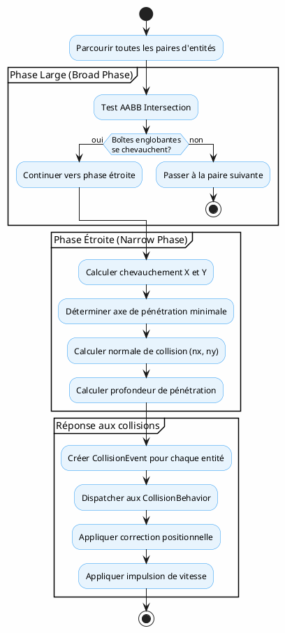
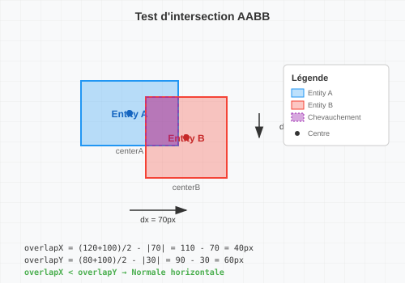
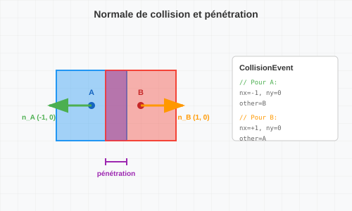
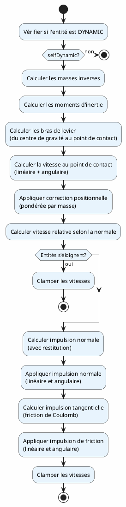
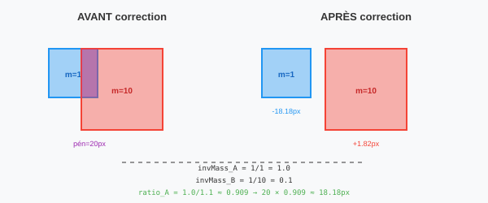
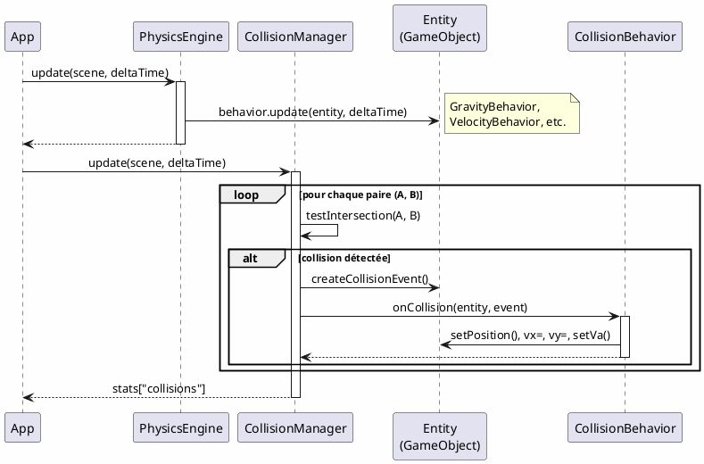
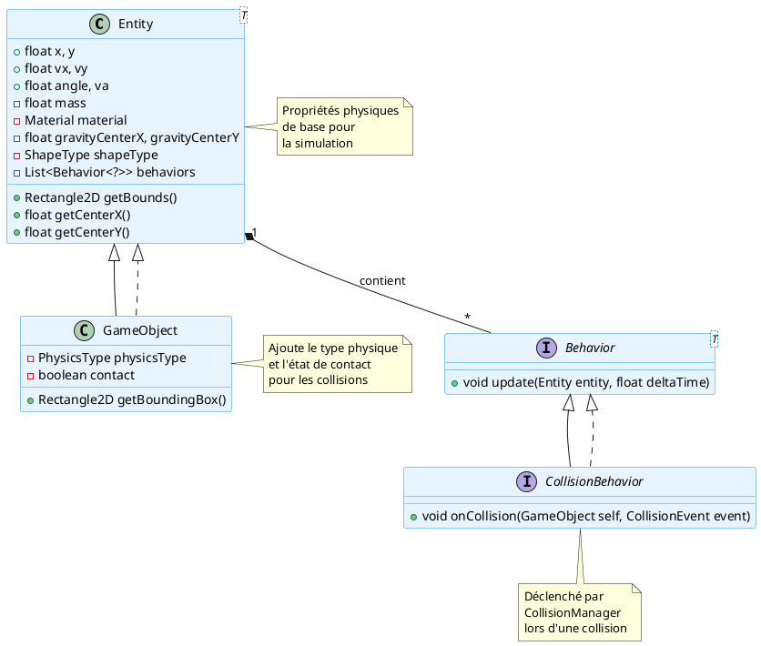
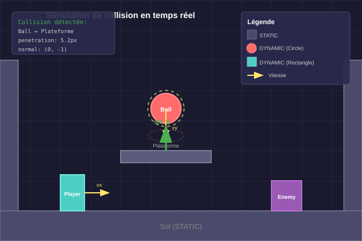

# Collision Detection

## Vue d'ensemble

Ce chapitre décrit le système de détection et de réponse aux collisions implémenté dans le moteur. Le système repose sur trois composants principaux :

- **CollisionManager** : Service de détection des collisions (phase large et étroite)
- **CollisionEvent** : Structure de données immuable décrivant une collision
- **CollisionBehavior** : Interface pour les comportements de réponse aux collisions

L'architecture sépare clairement la **détection** (qui est centralisée) de la **réponse** (qui est déléguée aux comportements des entités), permettant une grande flexibilité et modularité.

## Architecture du système de collision

### Flux de traitement



### Diagramme de classes

```plantuml
@startuml
skinparam classBackgroundColor #E8F4FD
skinparam classBorderColor #2196F3

package "core.physics" {
    class CollisionManager extends Service {
        + CollisionManager(App app)
        + void initialize(Configuration config)
        + void update(Scene scene, float deltaTime, Map stats)
        - void dispatchCollision(GameObject entity, CollisionEvent event)
    }

    record CollisionEvent {
        + GameObject other
        + float nx
        + float ny
        + float penetration
        + boolean selfDynamic
        + boolean otherDynamic
    }
}

package "core.behavior" {
    interface CollisionBehavior extends Behavior {
        + void onCollision(GameObject self, CollisionEvent event)
        + void update(Entity entity, float deltaTime)
    }

    class DefaultCollisionResponseBehavior implements CollisionBehavior {
        - {static} float MAX_LINEAR_VELOCITY
        - {static} float MAX_ANGULAR_VELOCITY
        - {static} float MIN_LINEAR_VELOCITY
        - {static} float MIN_ANGULAR_VELOCITY
        - {static} float ROTATION_VELOCITY_THRESHOLD
        + void onCollision(GameObject self, CollisionEvent event)
        - float computeInertia(GameObject go, float mass)
        - float computeEffectiveInvInertia(ShapeType, boolean, float, float)
        - void clampVelocities(GameObject entity)
    }
}

package "core.entity" {
    class GameObject extends Entity {
        - PhysicsType physicsType
        - boolean contact
        + Rectangle2D getBounds()
        + float getCenterX()
        + float getCenterY()
    }

    enum PhysicsType {
        NONE
        STATIC
        DYNAMIC
        KINETIC
    }

    enum ShapeType {
        POINT
        LINE
        RECTANGLE
        CIRCLE
        POLYGON
        SPRITE
    }
}

CollisionManager --> CollisionEvent : crée
CollisionManager --> CollisionBehavior : invoque
CollisionManager --> GameObject : détecte collisions
CollisionBehavior --> CollisionEvent : reçoit
DefaultCollisionResponseBehavior --> GameObject : modifie
GameObject --> PhysicsType : utilise
GameObject --> ShapeType : utilise
@enduml
```

## Détection des collisions : CollisionManager

### Principe de fonctionnement

Le `CollisionManager` est un `Service` qui parcourt toutes les paires uniques d'entités `GameObject` actives dans la scène et teste leurs intersections.

### Algorithme en deux phases

#### Phase Large (Broad Phase) - Test AABB

La première phase utilise un test d'intersection des **boîtes englobantes alignées aux axes** (AABB - Axis-Aligned Bounding Box). Ce test est très rapide et permet d'éliminer rapidement les paires d'entités qui ne peuvent pas être en collision.

```java
if (!goA.getBounds().intersects(goB.getBounds())) continue;
```

#### Phase Étroite (Narrow Phase) - Calcul SAT simplifié

Si les AABB se chevauchent, on calcule le chevauchement précis sur chaque axe :

```java
float dx = goA.getCenterX() - goB.getCenterX();
float dy = goA.getCenterY() - goB.getCenterY();

float halfWidthSum = (goA.getWidth() + goB.getWidth()) / 2.0f;
float halfHeightSum = (goA.getHeight() + goB.getHeight()) / 2.0f;

float overlapX = halfWidthSum - Math.abs(dx);
float overlapY = halfHeightSum - Math.abs(dy);
```

L'axe avec le **chevauchement minimal** détermine la **normale de collision** :

- Si `overlapX < overlapY` : collision horizontale, normale sur l'axe X
- Sinon : collision verticale, normale sur l'axe Y

### Illustration : Détection AABB



### Calcul de la normale de collision

La normale de collision pointe toujours **de l'autre entité vers soi** :

```java
float nx, ny;
float penetration;
if (overlapX < overlapY) {
    nx = dx > 0 ? 1.0f : -1.0f;
    ny = 0;
    penetration = overlapX;
} else {
    nx = 0;
    ny = dy > 0 ? 1.0f : -1.0f;
    penetration = overlapY;
}
```

### Illustration : Normale et pénétration



## Structure CollisionEvent

Le `CollisionEvent` est un **record** Java immuable qui encapsule toutes les informations nécessaires à la réponse d'une collision :

```java
public record CollisionEvent(
    GameObject other,           // L'autre entité impliquée
    float nx, float ny,         // Normale de collision (vecteur unitaire)
    float penetration,          // Profondeur de pénétration (≥ 0)
    boolean selfDynamic,        // L'entité recevant cet événement est DYNAMIC ?
    boolean otherDynamic        // L'autre entité est DYNAMIC ?
) {}
```

### Propriétés importantes

| Propriété | Description |
|-----------|-------------|
| `other` | Référence vers l'autre `GameObject` impliqué |
| `nx`, `ny` | Composantes de la normale unitaire, pointant **vers** l'entité recevante |
| `penetration` | Profondeur de chevauchement le long de la normale |
| `selfDynamic` | Indique si l'entité courante peut être déplacée |
| `otherDynamic` | Indique si l'autre entité peut être déplacée |

## Interface CollisionBehavior

Le `CollisionBehavior` est une spécialisation de `Behavior` dédiée aux réponses de collision :

```java
public interface CollisionBehavior extends Behavior<GameObject> {

    void onCollision(GameObject self, CollisionEvent event);

    @Override
    default void update(Entity<?> entity, float deltaTime) {
        // No-op : les comportements de collision sont événementiels
    }
}
```

### Modèle événementiel

Contrairement aux comportements classiques appelés à chaque frame via `update()`, les `CollisionBehavior` sont **déclenchés par événement** via leur méthode `onCollision()`. Cela permet :

- Une meilleure séparation des responsabilités
- Des réponses multiples par entité (plusieurs `CollisionBehavior` possibles)
- Un contrôle fin sur chaque type de collision

## Réponse aux collisions : DefaultCollisionResponseBehavior

La classe `DefaultCollisionResponseBehavior` implémente une réponse physique complète basée sur les impulsions :

### Étapes de la réponse



### Correction positionnelle

La première étape consiste à séparer les entités qui se chevauchent :

```java
float correctionRatio = invMassSelf / invMassSum;
self.setPosition(
    self.x + nx * penetration * correctionRatio,
    self.y + ny * penetration * correctionRatio);
```

La correction est **pondérée par les masses inverses** : une entité plus légère sera déplacée davantage.

### Illustration : Correction positionnelle



### Impulsion normale (rebond)

Le calcul de l'impulsion normale utilise la **restitution** (élasticité) des matériaux :

$$j_n = \frac{-(1 + e) \cdot v_{rel,n}}{m_A^{-1} + m_B^{-1} + \frac{(r_A \times n)^2}{I_A} + \frac{(r_B \times n)^2}{I_B}}$$

Où :
- $e$ = coefficient de restitution minimum des deux matériaux
- $v_{rel,n}$ = vitesse relative projetée sur la normale
- $r_A$, $r_B$ = bras de levier (du centre de gravité au point de contact)
- $I_A$, $I_B$ = moments d'inertie

### Impulsion tangentielle (friction)

La friction suit le modèle de **Coulomb** :

$$|j_t| \leq \mu \cdot |j_n|$$

```java
float maxFriction = friction * Math.abs(jn);
jt = Math.max(-maxFriction, Math.min(maxFriction, jt));
```

### Moment d'inertie

Le calcul du moment d'inertie dépend du `ShapeType` :

| ShapeType | Formule d'inertie |
|-----------|-------------------|
| `CIRCLE` | $I = \frac{1}{2} m r^2$ |
| `RECTANGLE`, autres | $I = \frac{m(w^2 + h^2)}{12}$ |

Le théorème de **Huygens-Steiner** (axe parallèle) est appliqué si le centre de gravité diffère du centre géométrique :

$$I_{gc} = I_{center} + m \cdot d^2$$

### Seuils de sécurité

Le comportement applique des limites pour éviter les instabilités :

| Constante | Valeur | Description |
|-----------|--------|-------------|
| `MAX_LINEAR_VELOCITY` | 5000 px/s | Vitesse linéaire maximale |
| `MAX_ANGULAR_VELOCITY` | 720 °/s | Vitesse angulaire maximale |
| `MIN_LINEAR_VELOCITY` | 0.05 px/s | Seuil sous lequel la vitesse est annulée |
| `MIN_ANGULAR_VELOCITY` | 0.1 °/s | Seuil sous lequel la rotation est annulée |
| `ROTATION_VELOCITY_THRESHOLD` | 3000 px/s | Vitesse minimale pour faire tourner un rectangle |

## Intégration avec PhysicsEngine et Entity

### Cycle de mise à jour



### Relation Entity → GameObject → CollisionBehavior



## Types de physique (PhysicsType)

Le comportement de collision dépend du `PhysicsType` des entités :

| PhysicsType | Description | Peut bouger | Reçoit impulsions |
|-------------|-------------|-------------|-------------------|
| `NONE` | Pas de physique | Non | Non |
| `STATIC` | Objet fixe (murs, sol) | Non | Non |
| `DYNAMIC` | Objet mobile complet | Oui | Oui |
| `KINETIC` | Mouvement contrôlé (plateformes) | Script | Non |

### Règles de collision

```plaintext
DYNAMIC ↔ DYNAMIC  : Réponse mutuelle (pondérée par masse)
DYNAMIC ↔ STATIC   : Seul DYNAMIC reçoit l'impulsion
DYNAMIC ↔ KINETIC  : Seul DYNAMIC reçoit l'impulsion
STATIC ↔ STATIC    : Ignoré (pas de collision)
NONE ↔ *           : Ignoré (pas de collision)
```

## Simulation visuelle



## Exemple d'utilisation

### Création d'un GameObject avec collision

```java
// Création d'une balle rebondissante
GameObject ball = new GameObject("ball")
    .setPosition(100, 50)
    .setSize(30, 30)
    .setShapeType(ShapeType.CIRCLE)
    .setPhysicsType(PhysicsType.DYNAMIC)
    .setMass(1.0f)
    .setMaterial(Material.RUBBER)  // Haute restitution
    .setFillColor(Color.RED)
    .add(new GravityBehavior())
    .add(new VelocityBehavior())
    .add(new DefaultCollisionResponseBehavior());

// Création d'un sol statique
GameObject ground = new GameObject("ground")
    .setPosition(0, 300)
    .setSize(400, 50)
    .setPhysicsType(PhysicsType.STATIC)
    .setMaterial(Material.WOOD)
    .setFillColor(Color.DARK_GRAY);

// Ajout à la scène
scene.addEntity(ball).addEntity(ground);
```

### Comportement de collision personnalisé

```java
public class BouncySoundBehavior implements CollisionBehavior {

    @Override
    public void onCollision(GameObject self, CollisionEvent event) {
        // Jouer un son proportionnel à la vitesse d'impact
        float impactSpeed = Math.abs(
            self.vx * event.nx() + self.vy * event.ny()
        );
        
        if (impactSpeed > 50) {
            SoundManager.play("bounce", impactSpeed / 500f);
        }
    }
}
```

## Résumé

Le système de collision du moteur offre :

| Aspect | Implémentation |
|--------|----------------|
| **Détection** | AABB en phase large, SAT simplifié en phase étroite |
| **Réponse** | Impulsions avec masse et inertie, modèle Coulomb pour friction |
| **Architecture** | Séparation détection/réponse via `CollisionBehavior` |
| **Flexibilité** | Plusieurs comportements de collision par entité possibles |
| **Stabilité** | Seuils de vitesse et clamping pour éviter les instabilités |

Cette architecture permet d'étendre facilement le système (nouvelles formes, nouveaux comportements) tout en maintenant une séparation claire des responsabilités.
